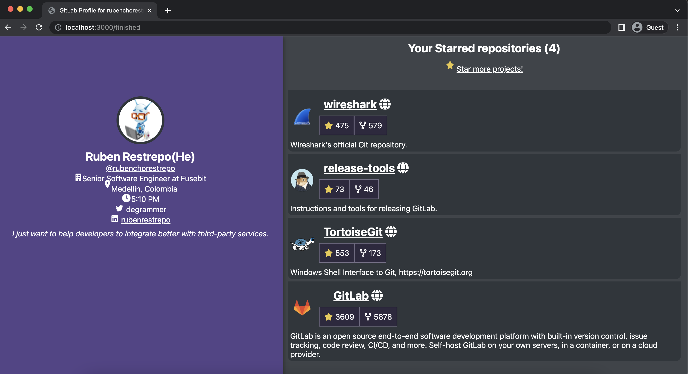

# GitLab Application Example

This example assumes you already have EveryAuth configured in your development environment. In case you don’t, follow the [configuration steps](https://github.com/fusebit/everyauth-express#getting-started).

You have an existing Express.js application that needs to integrate with GitLab API to display the following information:
- User profile information
- User starred repositories

The application will display the authorizing user’s GitLab profile that looks like the following:



### Configuring EveryAuth

This blog post assumes you already have EveryAuth configured in your development environment. In case you don’t, follow the [configuration steps](https://github.com/fusebit/everyauth-express#getting-started) from the EveryAuth GitHub Repository.

A basic Express application will look like the following:

```javascript
const express = require('express');

const app = express();
const port = 3000;

app.listen(port, () => {
  console.log(`Example app listening on port ${port}`);
});
```

Let’s add support to EveryAuth and configure the Gitlab service so we can interact with their API.

## Install dependencies

For interacting with Gitlab API from Node.js we will use the popular Node.js SDK for GitLab [@gitbeaker/node](https://www.npmjs.com/package/@gitbeaker/node)

```shell
npm i @gitbeaker/node
```

Install the [@fusebit/everyauth-express](https://www.npmjs.com/package/@fusebit/everyauth-express) package

```shell
npm i @fusebit/everyauth-express
```

Install the [uuid](https://www.npmjs.com/package/uuid) package. Used to generate a unique identifier for the userId.

```shell
npm i uuid
```
Install the [cookie-session](https://www.npmjs.com/package/cookie-session) package to allow your application to establish a session (an HTTP-Only cookie) to store the authorizing user id.

```shell
npm i cookie-session
```

## Add Routes

There are two critical routes we need to add to our application:

- Authorize route
- Finished route

Let’s understand the role of each route:

### Authorize route

EveryAuth middleware enables your application to perform an authorization flow for a particular service.
EveryAuth provides an out-of-the-box shared GitLab OAuth Client so that you can get up and running quickly.

EveryAuth simplifies a lot the authorization flow:

```javascript
  app.use(
    '/authorize/:userId',
    (req, res, next) => {
      if (!req.params.userId) {
        return res.redirect('/');
      }
      return next();
    },
    everyauth.authorize('gitlab’, {
      // The endpoint of your app where control will be returned afterwards
      finishedUrl: '/finished',
      // The user ID of the authenticated user the credentials will be associated with
      mapToUserId: (req) => req.params.userId,
   })
  );
```

You can define any name you want for the authorization route. In our previous example, it’s called `authorize`, but it’s up to you, and your application needs to use a different name/path. 

### Finished route

After the authorization flow finishes, control is returned to your application by redirecting the user to the configured `finishedUrl` in the `authorize` route.
The redirection includes query parameters that your application can use to know the [operation status](https://github.com/fusebit/everyauth-express#parameters---2).
You can use any path for the route. Just ensure it matches what you have configured in the `finishedUrl` property.
In this route, you can now interact with the Gitlab API by leveraging the EveryAuth service to get a fresh access token.
 
We will get the authorizing GitLab user information and starred repositories using the REST API.

```javascript
app.get('/finished', handleSession, async (req, res) => {
  const userCredentials = await everyauth.getIdentity('gitlab', req.session.userId);
  const gitlabClient = new Gitlab({ oauthToken: userCredentials.accessToken });
  const user = await gitlabClient.Users.current();

  // Get the last top 10 user starred repositories from GitLab.
  const projects = await gitlabClient.Projects.all({ maxPages: 1, perPage: 10, starred: true });
   . . . render the data
});
```

Now, we need to display the data. We will use a simple template engine called [pug](https://www.npmjs.com/package/pug), which allows us to quickly render an HTML page with the data returned from GitHub.

Install the dependency and set it as the default view engine:

```shell
npm i pug
```

```javascript
app.set('view engine', 'pug');
```

Define the pug template by creating a `views` folder and the name of the view. In our case, it’s called `index.pug`. Add the following code:

```pug
  html
  head
    title=title
    style
      include ./style.css
    script(src='https://cdnjs.cloudflare.com/ajax/libs/font-awesome/6.1.1/js/all.min.js' defer integrity='sha512-6PM0qYu5KExuNcKt5bURAoT6KCThUmHRewN3zUFNaoI6Di7XJPTMoT6K0nsagZKk2OB4L7E3q1uQKHNHd4stIQ==' crossorigin='anonymous')
  body
    .container
      .profile
        .top
          img.pic(src=avatar_url alt='GitHub Avatar')
          h2=`${name}(${pronouns})`
          a(href=web_url) @#{username}
        unless !followers
          p.followers
            i(class='fa-solid fa-users')
            span #{followers} followers
            span(class='separator') -
            span #{following} following
        unless !job_title
          section
            span
                i(class='fa-solid fa-building')
            span=`${job_title} at ${organization}`
        unless !location
          section
            span
                i(class='fa fa-bounce fa-location-dot')
            span #{location}
        unless !local_time
        section
          span
              i(class='fa-solid fa-beat fa-clock')
          span=local_time
        unless !twitter
          section
            span
                i(class='fa-brands fa-twitter')
            span 
              a(href=`https://www.twitter.com/${twitter}` target='_blank') #{twitter}
        unless !skype
          section
            span
                i(class='fa-brands fa-skype')
            span=skype
        unless !linkedin
          section
            span
                i(class='fa-brands fa-linkedin')
            span 
              a(href=`https://www.linkedin.com/in/${linkedin}` target='_blank') #{linkedin}
        p.quote=bio
      .public-repos
        h2 Your Starred repositories (#{projects.length})
        unless !projects.length
          .more-projects 
            a(href='https://gitlab.com/explore/projects' target='_blank')
              i(class='fa-solid fa-bounce fa-star')
              span= 'Star more projects!'
        .projects
          unless projects.length
            .empty
              a(href='https://gitlab.com/explore/projects' target='_blank') 0 Starred repositories, explore projects here
          each val in projects
            .project-item 
              .project
                .project-avatar-container
                  img.project-avatar(src=val.avatar_url alt=`${val.name}`)
                .project-name
                  h2
                    a(href=val.web_url title=val.description target="_blank")=val.name
                    span.icon 
                      i(class='fa-solid fa-globe')
                  span.counter
                    i(class='fa-solid fa-star')
                    span=val.star_count
                  span.counter
                    i(class='fa-solid fa-code-fork')
                    span=val.forks_count
              p=val.description
```

Render the data:

```javascript
   res.render('index', {
    title: `GitLab Profile for ${user.username}`,
    ...user,
    projects
  });
```

Run your application (assuming your code is defined in index.js file)

```shell
node .
```

Navigate to `http://localhost:3000`
