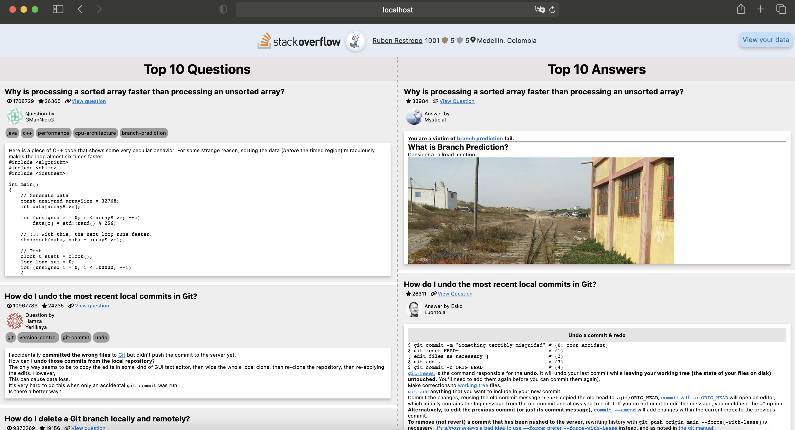

# StackOverFlow Example

This example assumes you already have EveryAuth configured in your development environment. If you don't, follow the [configuration steps](https://github.com/fusebit/everyauth-express#getting-started). 

This example contains an Express.js application that integrates with the StackOverflow API using the [superagent](https://www.npmjs.com/package/superagent) package to display the following information:
- StackOverflow's authorized user profile information: picture, name, location, reputation, and badge counts.
- StackOverflow's authorizing user top 10 questions and answers.
- StackOverflow's top 10 questions and answers.


Once the application is authorized, you will see something similar like the following image:


## Install dependencies

```bash
npm i
```

Run the application

```bash
node .
```

Navigate to `http://localhost:3000`

If you're in development mode run

Run the application

```bash
npm run dev
```

[Read our blog post about integrating with StackOverflow](https://fusebit.io/blog/using-stackoverflow-with-everyauth?utm_source=github.com&utm_medium=referral&utm_campaign=everyauth-examples&utm_content=using-stackoverflow-with-everyauth)